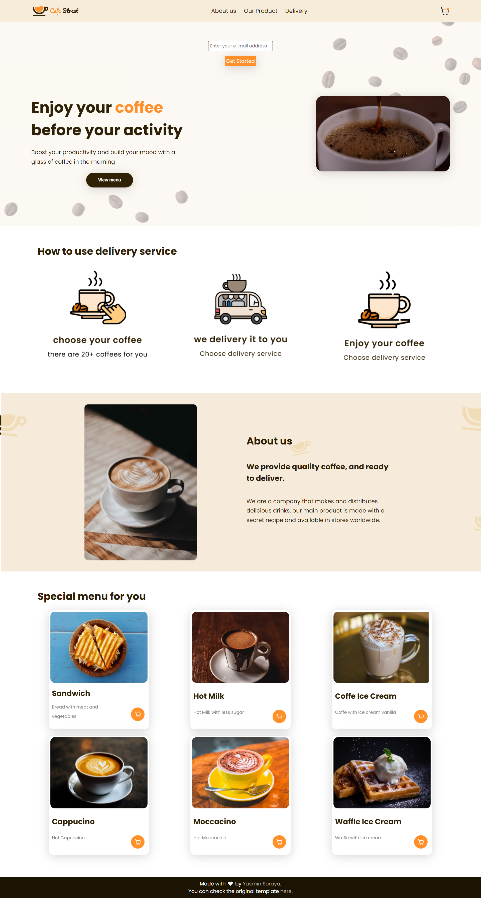

    

## 💻 Projeto
Esse é um projeto Web responsivo de uma página inicial para produtos de uma loja.

## 🚀 Tecnologias
Esse projeto foi desenvolvido durante o freeCodeCamp com as seguintes tecnologias:
- HTML
- CSS

## 🏷 Tecnologias
Você pode visualizar o layout de inspiração do projeto através [desse link](https://www.figma.com/community/file/1138256358581554095).
